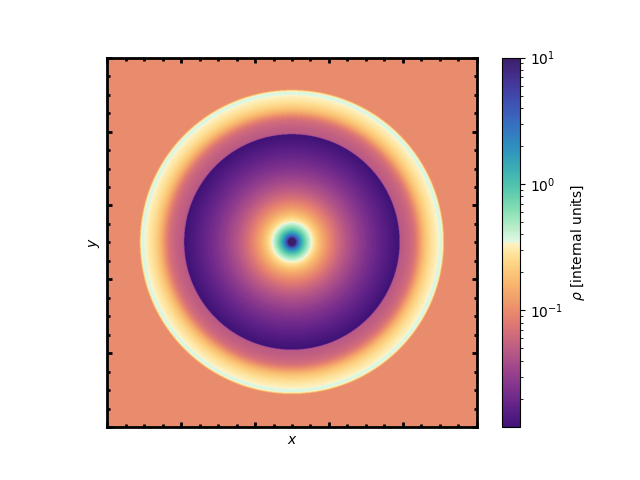

# SHOCKr
SHOCKr is a 1D spherical hydro solver designed for studying the shock structure emerging from the interaction between a spherically symmetric wind and an ambient medium with any specified density, velocity and temperature structure.


<em> Fig. 1: Density slice of spherical outflow solution produced by SHOCKr. The central wind (modelled as a boundary condition) streams radially outwards until it encounters a reverse shock. The wind also drives a forward shock. Simulation performed in domain with 1,000 radial cells, using the HLLC Riemann solver. </em>

## Key Highlights

- **Spherical Modeling:** Simulate hydrodynamics in a 1D spherical framework.
- **Shock Structure Study:** Explore and analyze shock structures resulting from wind and ambient medium interaction.
- **On-the-Fly Shock Finder:** Shockr incorporates a real-time shock finder that dynamically identifies shock fronts during simulations without the need for post-processing.
- **Subsonic & Supersonic winds :** Shockr supports the injection of both supersonic and subsonic winds. 

## Euler Equations
Shockr is based on the spherical symmetric form of the Euler equations, governing fluid dynamics in a 1D radial direction. The set of equations solved by SHOCKr are

1. **Continuity Equation:**
   $$\ \frac{\partial \rho}{\partial t} + \frac{1}{r^2} \frac{\partial}{\partial r}(r^2 \rho v_r) = 0 \$$

2. **Radial Momentum Equation:**
   $$\ \frac{\partial (\rho v_r)}{\partial t} + \frac{1}{r^2} \frac{\partial}{\partial r}(r^2 \rho v_r^2 + P) = 0 \$$

3. **Energy Equation:**
   $$\ \frac{\partial E}{\partial t} + \frac{1}{r^2} \frac{\partial}{\partial r}\left(r^2 (E + P) v_r\right) = 0 \$$

Where:
- \(\rho\) is the density
- \(v_r\) is the radial velocity
- \(P\) is the pressure
- \(E\) is the total energy per unit volume

## Additional Features

- **Riemann Solvers:** SHOCKr includes two Riemann solvers: HLLC (Harten, Lax, van Leer, and Contact) and Rusanov,
- **Wind Boundary Condition:** The spherically symmetric wind is modeled as a boundary condition,
- **Cartesian 1D Support:** While primarily designed for spherical simulations, SHOCKr also supports Cartesian 1D simulations for added flexibility.

## Configuration File Explanation

The `config.txt` file is used to specify various parameters for the simulation. Below is an explanation of each parameter:

- **maxTime**: Maximum simulation time in code units.

- **outputTimeInterval**: Time interval at which simulation results are outputted to files.

- **outputFilename**: Name of the file where general simulation output will be stored.

- **outputEnergy**: Name of the file where energy-related data will be stored.

- **gridMin**: Location of the first grid cell in the domain.

- **gridMax**: Location of the last grid cell in the domain.

- **NumberCells**: Number of cells in the grid.

- **NumberGhostCells**: Number of ghost cells in the grid. Ghost cells are used to handle boundary conditions.

- **bgDensity**: Background density for the simulation.

- **bgVel**: Background velocity.

- **bgPressure**: Background pressure.

- **windDensity**: Density of the wind.

- **windVel**: Velocity of the wind.

- **windPressure**: Pressure of the wind.

## Example Configuration File:

```plaintext

maxTime            1.0
outputTimeInterval 0.1
outputFilename     output.txt
outputEnergy       energy.txt

gridMin            0.01
gridMax            10.0
NumberCells        1000
NumberGhostCells   1

bgDensity          0.1
bgVel              0.0
bgPressure         0.01

windDensity        100
windVel            20.
windPressure       0.0001
